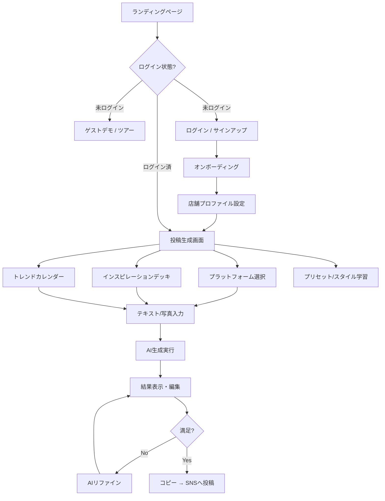

# MisePo (ミセポ) 要件定義書

> コードベースから逆算して作成（2026年2月16日時点）

---

## 1. プロジェクト概要

### 1.1 プロダクトビジョン
店舗オーナー（飲食店、カフェ、美容室等）向けの **AI投稿アシスタント**。Google Gemini を活用し、店舗の個性を維持しながら高品質なSNS投稿文・口コミ返信を数秒で自動生成する。

### 1.2 核心価値
- **「AIなのに自分らしい」**: 過去の投稿を学習し、オーナー特有の口癖・絵文字のクセまで再現
- **「爆速・簡単」**: メモ書き程度の入力 → プラットフォーム最適化された文章を自動生成
- **「信頼の獲得」**: Google Maps口コミ返信など、誠実さが求められるシーンを強力にサポート

### 1.3 ターゲットユーザー
個人店舗オーナー（飲食店、カフェ、居酒屋、美容室、ネイル・まつげ、エステ・サロン、旅館・ホテル、整体・接骨院、ジム、小売、その他）

---

## 2. 機能要件

### 2.1 投稿生成（コアエンジン）

| 項目 | 詳細 |
|------|------|
| 対応プラットフォーム | Instagram, X (Twitter), LINE, Google Maps, 一般 |
| 入力方式 | テキスト入力 / 写真アップロード（Photo-to-Post） |
| トーン制御 | きっちり / 標準 / 親しみ / カジュアル |
| 長さ制御 | 短め / 普通 / 長め |
| 投稿目的 | 宣伝・告知 / ストーリー・感想 / お役立ち情報 / 問いかけ・交流 |
| 多言語対応 | 日本語, English, 简体中文, 繁體中文, 한국어, Español |
| 装飾制御 | 絵文字の有無 / 記号装飾の有無 |
| X制約 | 140文字制限モード |
| Instagramフッター | 店舗情報・ハッシュタグの自動付与 |

### 2.2 AIリファイン（生成後の微調整）
- 生成済み文章に対してAIに追加指示を出し、トーンや内容を修正
- プリセットチップ: 「✨ 整える」「📝 短くする」「📣 情熱的に」「🤝 丁寧に」
- 自由テキストによるカスタム指示も可能
- 1回のリファインで1クレジット消費

### 2.3 Google Maps 口コミ返信（特化機能）
- 星評価（1〜5）に基づく自動トーン調整
- 返信目的: 自動判定 / お礼 / 謝罪 / 補足説明
- 返信深度: あっさり / バランス / 丁寧
- ネガティブレビュー検出（攻撃的な表現・一般的なクレームの自動判定）
- Google Place ID によるビジネスリンク

### 2.4 文体学習・プリセット管理

| 項目 | 詳細 |
|------|------|
| スタイル学習 | 過去の投稿サンプルをプラットフォーム別に登録 → AIがFew-shot Learningで文体を模倣 |
| ペルソナ分析 | 登録サンプルをAIが分析 → YAML形式のペルソナルールを自動生成 |
| サニタイズ | 学習サンプルの個人情報・不要情報をAIが自動除去 |
| SNS/Maps別管理 | SNS投稿用とGoogle Maps返信用で異なるスタイルを設定可能 |
| プリセット切替 | 複数ペルソナ（例: 「情熱店長」「親しみスタッフ」）を保存・ドラッグ&ドロップで並び替え |
| アバター | 12種類のアイコン（店舗、店主、スター、公式、カフェ等） |

### 2.5 AIソムリエ（インスピレーション提案）
- 業界・季節・トレンドに基づく「今日のおすすめネタ」カードデッキ
- AIがオーナーへの質問を生成 → 回答を元に投稿を作成（Q&Aモード）
- 業界別・共通のトピックテンプレートプール
- AIによるカスタムカード動的生成

### 2.6 トレンドカレンダー
- 月別のイベント・記念日カレンダー表示
- 各イベントにハッシュタグ・投稿プロンプトが紐づく
- 月送り/戻し対応、データはAPI経由で取得・キャッシュ

### 2.7 店舗プロファイル

| 項目 | 詳細 |
|------|------|
| 基本情報 | 業界、店舗名、活動地域、店舗の説明・こだわり |
| ターゲット層 | 全般/お一人様/働く人/ファミリー/学生/カップル・夫婦/女子会・ママ友/シニア/地元の方/観光客 |
| Google連携 | Google Places APIで店舗名からPlace IDを自動取得 |
| AI分析 | 店舗情報をAIが分析→最適化されたコンテキストおよびカスタムトピックを自動生成 |

---

## 3. ページ・画面構成

### 3.1 公開ページ

| パス | 画面 | 概要 |
|------|------|------|
| `/` | ランディングページ | Hero, 機能紹介, デモ, 料金, FAQ, CTA |
| `/login` | ログイン | Google OAuth / メール認証 |
| `/signup` | サインアップ | 新規登録 |
| `/start` | スタートフロー | 初回オンボーディング |
| `/blog` | ブログ一覧 | SEO記事一覧（6記事） |
| `/blog/[slug]` | ブログ記事 | Markdown → HTML変換 |
| `/terms` | 利用規約 | 法的ページ |
| `/privacy` | プライバシーポリシー | 法的ページ |
| `/commercial-law` | 特定商取引法 | 法的ページ |
| `/preview` | プレビュー | 投稿プレビュー |
| `/tools/release-visual` | リリースビジュアルツール | 販促画像生成（スマホモックアップ＋テキスト合成・PNG書き出し） |

### 3.2 認証後ページ

| パス | 画面 | 概要 |
|------|------|------|
| `/generate` | 投稿生成（メイン画面） | プラットフォーム選択→入力→生成→結果表示 |
| `/billing` | 課金管理 | プラン一覧 |
| `/billing/success` | 決済完了 | 成功画面 |
| `/billing/cancel` | 決済キャンセル | キャンセル画面 |
| `/billing/manage` | プラン管理 | Stripeポータルへ遷移 |
| `/upgrade` | アップグレード | Pro誘導 |

### 3.3 主要モーダル・オーバーレイ

| コンポーネント | 概要 |
|------|------|
| PresetModal | プリセット管理（スタイル学習・ペルソナ分析・サンプル登録） |
| AccountSettingsModal | アカウント設定・プラン確認・Stripeポータル・ログアウト |
| PostPreviewModal | 生成結果のプレビュー（LINEトーク風表示対応） |
| GuestDemoModal | 未ログインユーザー向けデモ |
| GuestTour | 初回ユーザー向けステップバイステップガイド |
| GuideModal | 機能説明ウォークスルー |
| LoadingModal | AI生成中のローディング表示（運用TIPSをローテーション表示） |
| Onboarding | 初期設定ウィザード（Google Places API連携） |
| Feedback | アプリ内フィードバック送信（星評価＋テキスト） |
| MobileCalendarOverlay | トレンドカレンダー（モバイル用） |

---

## 4. API一覧

### 4.1 AI系

| エンドポイント | 機能 |
|------|------|
| `POST /api/generate` | 投稿文の生成（メインエンジン） |
| `POST /api/refine` | 生成済み文章のAIリファイン |
| `POST /api/ai/analyze-persona` | 学習サンプルからペルソナルール(YAML)を自動生成 |
| `POST /api/ai/analyze-screenshot` | アップロード画像の解析（Photo-to-Post） |
| `POST /api/ai/inspiration` | インスピレーションカード生成 / ソムリエ質問生成 |
| `POST /api/ai/sanitize` | 学習サンプルの個人情報除去 |
| `GET /api/trends` | トレンド・イベントデータ取得 |

### 4.2 ユーザーデータ系

| エンドポイント | 機能 |
|------|------|
| `/api/me/store-profile` | 店舗プロファイル CRUD |
| `/api/me/presets` | プリセット CRUD（並び替え含む） |
| `/api/me/history` | 生成履歴 CRUD |
| `/api/me/learning` | 学習サンプル管理 |
| `/api/me/plan` | プラン情報取得 |
| `/api/me/analyze-store` | 店舗情報のAI分析 |
| `/api/usage` | 使用量確認 |

### 4.3 課金系

| エンドポイント | 機能 |
|------|------|
| `POST /api/billing/checkout` | Stripeチェックアウトセッション作成 |
| `POST /api/billing/portal` | Stripeカスタマーポータル作成 |
| `POST /api/billing/webhook` | Stripe Webhook受信（サブスクリプション管理） |

---

## 5. データベース構成（Supabase）

| テーブル | 用途 |
|------|------|
| `entitlements` | ユーザーのプラン・ステータス・トライアル期限・Stripe参照ID |
| `ai_runs` | AI実行ログ（使用量計測用） |
| `promotion_redemptions` | 初回割引クーポン追跡 |
| `feedback` | ユーザーフィードバック保存 |

### 5.1 課金プラン体系

| プラン | 月間上限 | 備考 |
|------|------|------|
| trial | 5回/日 | 7日間無料 |
| entry | 50回/月 | 有料 |
| standard | 150回/月 | 有料 |
| professional | 300回/月 | 有料 |

---

## 6. 技術スタック

| レイヤー | 技術 |
|------|------|
| Frontend | Next.js (App Router), TypeScript, Tailwind CSS, Framer Motion |
| Backend/DB | Supabase (Auth, PostgreSQL, Storage) |
| AI Engine | Google Gemini（Pro / Flash をプランに応じて使い分け） |
| Infrastructure | Vercel |
| Payments | Stripe (Checkout, Portal, Webhook) |
| PWA | Web App Manifest, Service Worker |
| 外部API | Google Places API（店舗情報取得） |
| DnD | @dnd-kit（プリセット並び替え） |
| Blog | Markdown → HTML（gray-matter + remark） |

---

## 7. 非機能要件

### 7.1 UX/UI
- **PWA**: ホーム画面追加、高速起動、オフライン基盤
- **モバイルファースト**: ボトムシート型UI、スワイプ操作対応
- **デザイン**: Neubrutalism要素（太いボーダー、影）とウォームトーンの融合
- **ゲスト体験**: 未ログインでもデモ体験・ツアーが可能
- **ローディングUX**: 生成中にtips表示でAI待ち時間を緩和

### 7.2 安全性
- 不適切表現の検出・リスク判定（abuse/commonNeg パターンマッチ）
- 学習サンプルのサニタイズ（個人情報自動除去）
- Supabase RLS + Middleware による認証ガード
- Stripe Webhook の署名検証

### 7.3 SEO
- sitemap.xml 自動生成（静的ページ + ブログ記事）
- robots.txt によるクローリング許可
- Open Graph / Twitter Card メタデータ
- ブログ記事によるコンテンツマーケティング（6記事）

### 7.4 多言語
- 生成テキストの出力言語を6言語から選択可能
- UI自体は日本語のみ

---

## 8. ユーザーフロー

